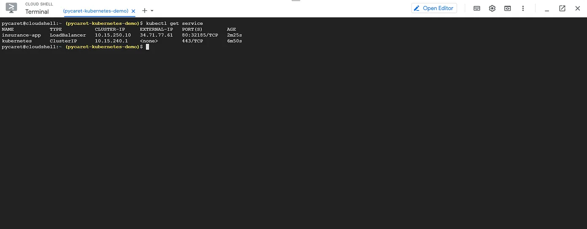

# Deploying My Machine Learning Pipeline on Google Kubernetes Engine

### To train and deploy my machine learning pipelines in Python using PyCaret

## 👉 My Learning Goals for this Tutorial

- Understand what a Container is, what Docker is, what Kubernetes is, and what Google Kubernetes Engine is.
- Build a Docker image and upload it to Google Container Registry (GCR).
- Create clusters and deploy my machine learning pipeline with a Flask app as a web service.
- See my web app in action, using a trained machine learning pipeline to predict on new data points in real-time.

## Kubernetes interface

## Application Interface
